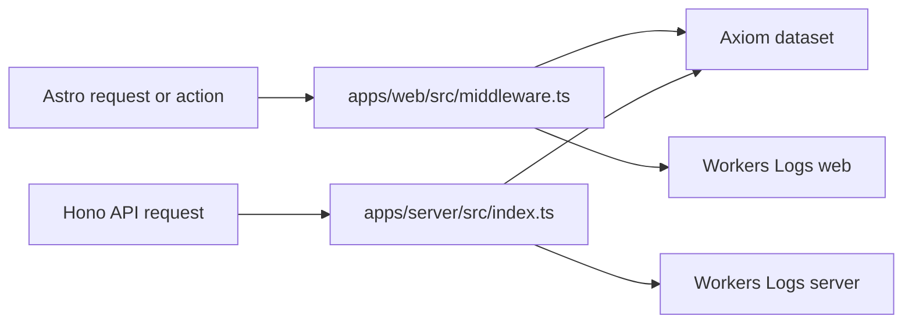

# Logging

evlog builds one **wide event** per request and writes it to `console`. Cloudflare [Workers Logs](https://developers.cloudflare.com/workers/observability/logs/workers-logs/) stores those console lines for **7 days**. The same events also drain to **Axiom** (Personal plan: 30-day retention, 500 GB ingest/month, 25 GB stored).

Do not drain every request as PostHog product events. Do not add a 5s `createDrainPipeline` batcher on Workers (that holds `waitUntil` for the interval).

## Pipeline



| Piece | File | What it does |
| --- | --- | --- |
| Web logger | `apps/web/src/middleware.ts` | `createRequestLogger` + `emit()` after the response. Service name: `faber-web-web`. Axiom drain via `initLogger({ drain })` and bound `waitUntil`. |
| Contact conversion | `apps/web/src/actions/index.ts` | Sets `action: "contact.submit"` (and outcome) on the request logger. |
| Server logger | `apps/server/src/index.ts` | Hono `evlog({ drain })`. Service name: `faber-web-server`. Better Auth `createAuthMiddleware` adds `userId` (auth routes skipped for identity only). |
| Axiom | `packages/infra/alchemy.run.ts` | `AXIOM_API_KEY` (ingest API token) and `AXIOM_DATASET` on both Workers. Drain no-ops if either binding is empty. |
| Persist | `packages/infra/alchemy.run.ts` | `observability.logs.persist: true` on both the Hono `server` Worker and the Astro `web` Worker. |

**Dashboards:**

- Axiom Stream/Query on dataset `AXIOM_DATASET` (typically `faber-web`). Filter by `service`: `faber-web-web` or `faber-web-server`.
- Cloudflare → Workers & Pages → **web** or **server** → Observability (7-day console backup).

Example APL:

```kusto
['faber-web']
| where service == "faber-web-server" or service == "faber-web-web"
```

**Shape:** JSON in production so Cloudflare indexes keys (`action`, `path`, `userId`, `service`). The API Worker always uses `pretty: false` (`NODE_ENV` is unreliable on Workers). The Astro Worker uses `pretty: import.meta.env.DEV` (readable locally, JSON in the production SSR bundle).

## Axiom setup

1. Create a free Personal account at [app.axiom.co/register](https://app.axiom.co/register).
2. Create one dataset (name it `faber-web`, or match whatever you set in `AXIOM_DATASET`).
3. Create an **API token** (Settings → API tokens) with **Basic** ingest permission on that dataset. Do **not** use a personal access token — Axiom ingest rejects PATs. Tokens look like `xaat-...`.
4. Put both values where Alchemy already loads dotenv (`packages/infra/.env`, `apps/web/.env`, or `apps/server/.env`):

```bash
AXIOM_API_KEY=xaat-...
AXIOM_DATASET=faber-web
```

Alchemy treats these as required at deploy, same as `BETTER_AUTH_SECRET`. Default ingest host is `https://api.axiom.co`. EU orgs (`eu.axiom.co`) need a `baseUrl` override that is not wired.

After `alchemy dev` or a deploy, trigger a contact submit and a 4xx, then confirm events in Axiom with the query above.

## Keep vs drop

Header and footer **still call** the API. We only skip **successful** wide events. Skipped events never reach Axiom or Workers Logs as fat JSON.

| Source | Request | Persist wide event? |
| --- | --- | --- |
| `AuthMenu.astro` `getSession()` | Yes — needed for Sign In vs user menu | No, on 2xx. Path: `/api/auth/get-session`. Sign-in / sign-up / sign-out stay logged. |
| `EdgeApiStatus.astro` `healthCheck()` | Yes — footer widget | **Only when the Edge API is offline** (throw / status >= 400). Do not exclude all of `/rpc` (that would drop `privateData`). |
| Contact form | Yes | Always (`contact.submit`). |
| Other API / 4xx / 5xx | Yes | Yes. |

Workers Logs still writes a thin **invocation log** (method, URL, status) for every request. Skipping evlog JSON only removes the fat custom event. Filter invocation logs with `status >= 400` if 200s are noisy.

On the API Worker, info-level events are sampled at 0% unless `keep` force-keeps them. Successful `/api/auth/get-session` and `/rpc/healthCheck` are not force-kept. Errors and every other route are.

## Bots

[Bot score](https://developers.cloudflare.com/bots/reference/bot-management-variables/) (`cf.botManagement.score`) needs Enterprise Bot Management. We do not use it.

- Crawlers that do **not** run JS never hit AuthMenu or the footer. They still hit Astro middleware. Skip successful page `emit()` when the User-Agent looks like a crawler (Googlebot, Bingbot, GPTBot, ClaudeBot, Bytespider, and similar) or `cf.botManagement.verifiedBot` is set.
- Always emit on status >= 400 and on `contact.submit`.
- JS bots still call get-session and healthCheck; those successes are already dropped above.

## What not to do

- Do not drain every request as PostHog **product events** (`mode: "events"`). That is billed per event and is mostly session/health noise.
- Do not enable Workers **traces** unless we accept extra quota (traces share log pricing from 1 October 2026).
- Do not wrap the Axiom drain in `createDrainPipeline` with a multi-second interval on Workers.
- Do not treat this as an audit archive. Audit trails (`log.audit`) are a separate evlog feature and are not wired.

## Skills

When changing logging, follow `review-logging-patterns` (and `build-audit-logs` if adding audits).
